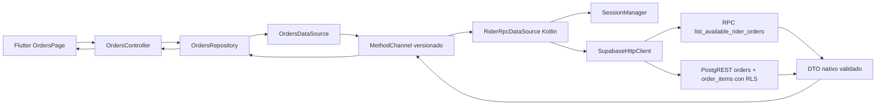

# Task 03 - Arquitectura de consulta de pedidos

Fecha de evidencia: 2026-08-01. Rama: `develop`. HEAD de entrada: `b64616f`.

## Alcance

Esta etapa implementa únicamente lectura de pedidos para el rider:

- pedidos disponibles;
- recuperación del pedido asignado al rider autenticado;
- revision como dato obligatorio;
- estado y dinero validados antes de llegar a Flutter;
- detalle operativo de solo lectura;
- refresh concurrente con descarte de respuestas viejas;
- recuperación al entrar nuevamente al shell autenticado.

No implementa claim, start delivery, GPS, mapa, cola offline, foreground
service ni publicación. Los CTA de claim/start quedan deshabilitados.

## Flujo de datos

## Responsabilidad Kotlin

`RiderRpcDataSource` es la única puerta nativa para pedidos. Obtiene el
contexto de sesión sin exponer access/refresh tokens a Dart, construye el
RPC exacto, hace el GET RLS autorizado para recuperación, clasifica errores y
ejecuta un único retry después de un 401. `SessionManager` serializa la
rotación y cancela las llamadas de pedidos antes del logout.

`BackendDtos` valida el cuerpo antes del bridge. Rechaza filas incompletas,
revisiones no positivas, estados no documentados, moneda distinta de ARS,
duplicados de `public_code` y más de una fila asignada. Los UUID internos sólo
se validan en Kotlin y no se incluyen en el mapa del bridge.

## Responsabilidad Dart

Flutter mantiene los modelos de dominio, mapeo, estado de pantalla, retry
manual, detalle, empty/error states y control de respuestas fuera de orden.
Cada refresh hace las dos lecturas en paralelo. Cada superficie conserva su
ultimo dato valido si la otra lectura falla; un resultado exitoso reemplaza su
snapshot anterior y una respuesta de una solicitud anterior se descarta por
serial de solicitud.

La UI sólo muestra los campos autorizados por `DTO_CONTRACT.md`. No representa
GPS, historial, teléfono, nombre de cliente, UUID interno ni una acción
mutante.

## Decisión sobre pedido asignado

El contrato auditado no expone una RPC pública de recuperación del pedido
asignado. `rider_order_rpc_payload(uuid)` es una función interna revocada para
roles cliente. Por eso esta etapa usa el endpoint PostgREST existente de
`orders`, con `order_items` anidado, filtros por `business_id`,
`assigned_rider_user_id`, estados operativos y `limit=1`. La autorización real
la siguen haciendo JWT + RLS (`can_access_order`); Android no muta filas.

Esta decisión no inventa una RPC, pero sí deja una incógnita de producto: si se
quiere evitar que el cliente consulte columnas operativas directamente, el
backend debe aprobar y publicar una RPC de recuperación en una etapa separada.

## Bridge

Métodos añadidos al channel `la_taba/rider_control`:

| Método | Resultado |
|---|---|
| `listAvailableOrders` | lista de filas minimizadas o error sanitizado |
| `getAssignedOrder` | una fila, `null` o error sanitizado |

El envelope conserva `ok`, `version=1`, `data` y `error`. `StandardMessageCodec`
recibe mapas/listas, nunca objetos Kotlin.

## Garantías y límites

- El listado disponible no puede reclamar ni iniciar una entrega.
- El pedido asignado se recupera al recrear la pantalla autenticada.
- Un refresh exitoso no se considera válido sin respuesta Supabase y DTO válido.
- La frescura de esta etapa es la `revision` mostrada y el descarte de
  respuestas viejas; no implementa todavía la frescura GPS de Gate 2.
- La lectura depende del contrato RLS vigente y de que los datos monetarios del
  negocio sean compatibles con ARS.
