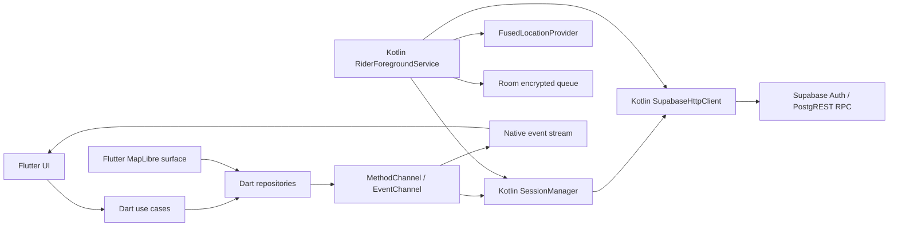

# LA TABA RIDER ANDROID — Arquitectura de referencia

Estado: Gate 0 — listo para implementación condicionada a las aprobaciones indicadas al final.

## Alcance

Esta propuesta define la app Android futura en `C:\1212\la-taba-rider-android` para riders autenticados de La Taba. El backend Supabase y el contrato de staging se consideran autoridad. La app no redefine RPCs, estados, permisos ni reglas de negocio.

La app debe soportar login, cola de pedidos disponibles, pedido asignado, claim atómico, inicio de reparto, publicación GPS mediante Gate 2, funcionamiento con pantalla apagada, cola offline acotada, recuperación, notificación persistente, mapa y freshness.

No se permite AccessibilityService, WebView, `service_role`, escritura directa a `rider_locations`, ni una segunda implementación de las reglas de transición.

## Decisión principal

Flutter es la superficie de producto y Kotlin es la autoridad de sesión, transporte Supabase y ejecución persistente. Dart no conserva una sesión independiente ni hace llamadas Supabase directas en producción.

La única autoridad de GPS en producción es `publish_rider_location`. El servicio nativo nunca inserta directamente en la tabla. `recorded_at` y `sequence` vienen de PostgreSQL; `captured_at` sólo se envía para que el servidor descarte muestras futuras o atrasadas.

## Responsabilidades por plataforma

### Dart / Flutter

- Presentación, navegación, estados de pantalla y accesibilidad normal de Flutter.
- Entidades de dominio: sesión, miembro, pedido, revisión, entrega activa, muestra GPS, freshness y estado de sincronización.
- Casos de uso: iniciar sesión, cargar pedidos, reclamar, iniciar entrega, completar con código, cerrar sesión y recuperar.
- Repositorios y mapeo de DTOs. Los DTOs deben conservar `revision`, `sequence`, `recorded_at` y `idempotent_no_op`.
- `RiderPlatformDataSource`: wrapper tipado del bridge; no implementa HTTP ni SQL.
- Presentación de eventos nativos: estado del servicio, permiso, última muestra aceptada, cola, error de sesión y detención.
- Mapa MapLibre: marcador propio, último fix confirmado y bandas `fresh/delayed/lost/none`. No interpola una posición que no llegó del servidor.
- Tests unitarios y de integración de casos de uso, mapeos, reducers y políticas de UI.

### Kotlin / Android

- Auth Supabase, refresh de sesión y almacenamiento cifrado como única fuente de verdad.
- Cliente HTTP explícito sobre HTTPS para Auth y `/rest/v1/rpc/*`, con `apikey` publicable y `Authorization: Bearer`.
- Serialización y traducción de errores SQLSTATE/RPC sin perder código ni mensaje técnico para diagnóstico interno.
- `RiderForegroundService` con `startForeground`, notificación persistente y ubicación mientras la entrega está activa.
- `FusedLocationProviderClient`, filtro de calidad, rate limiter local y envío/encolado de muestras.
- Cola durable cifrada, con TTL y descarte de GPS que el backend ya no aceptaría.
- Recuperación de proceso, conectividad y reanudación de eventos.
- Bridge hacia Flutter, con permisos, ciclo de vida, acciones de notificación y estado del servicio.
- Android unit tests, instrumented tests, tests de servicio y pruebas con dispositivos físicos.

## Límites de confianza

1. El usuario y el APK son clientes no confiables.
2. Kotlin protege la sesión local contra lectura casual; no convierte el teléfono en una autoridad.
3. Supabase Auth decide quién es el usuario; `business_members` decide si es rider activo del negocio.
4. PostgreSQL decide si un rider puede tomar un pedido, iniciar una entrega y publicar una muestra.
5. La UI sólo muestra datos que el servidor devolvió. No confirma éxito por la respuesta local del servicio.

## Flujo normal de datos

1. El usuario inicia sesión desde Flutter. El bridge delega a Kotlin `signInWithPassword`; Kotlin valida la membresía activa `role = rider` para el `business_id` de flavor.
2. Kotlin persiste access token, refresh token, expiraciones y user id cifrados. Dart recibe una vista mínima de sesión, nunca el refresh token.
3. Flutter solicita pedidos disponibles. Kotlin llama `list_available_rider_orders(p_business_id)` y Dart muestra sólo los campos que devuelve la RPC.
4. Claim envía `p_business_id`, `p_public_code`, `p_expected_revision`, `p_expected_status = ready`, `p_expected_rider_user_id = null`. La respuesta sustituye el snapshot local.
5. Iniciar entrega envía el UUID interno devuelto por la RPC y la `revision` vigente a `start_rider_delivery`. Si devuelve `idempotent_no_op = true`, se trata como éxito y no se duplica nada.
6. El servicio comienza a capturar. Cada muestra tiene `order_id`, `expected_revision`, coordenadas, precisión, rumbo, velocidad y `captured_at` ISO-8601. La respuesta del servidor aporta `sequence` y `recorded_at`.
7. El servicio publica eventos por EventChannel. Flutter actualiza estado y mapa; si no hay evento, no fabrica movimiento.
8. Al cambiar estado o volver la conectividad, Flutter solicita un refresh. Realtime, si se adopta, es sólo una señal; la autoridad es una lectura Supabase con `revision`.

## Estado de entrega en la app

La app debe usar exactamente el vocabulario efectivo descrito en `BACKEND_CONTRACT.md`. No agregará `in_progress`, `completed`, `paused_by_app` ni estados equivalentes al backend.

El estado local del servicio es separado y técnico: `stopped`, `arming`, `active`, `degraded`, `draining`, `stopping`, `failed`. Nunca se persiste como estado de pedido.

## Bridge

### MethodChannel: `la_taba/rider_control`

Métodos mínimos:

- `getSessionSnapshot`
- `signInWithPassword(email, password)`
- `signOut`
- `getRiderAccess(businessId)`
- `listAvailableOrders(businessId)`
- `claimOrder(args)`
- `startRiderDelivery(args)`
- `confirmOrderDelivery(args)`
- `getActiveDelivery`
- `prepareForegroundDelivery(args)`
- `activateForegroundDelivery(args)`
- `stopForegroundDelivery(reason)`
- `requestLocationPermission`
- `getServiceSnapshot`

Cada método devuelve `{ok, data?, error?}`. `error` contiene `kind`, `sqlState?`, `messageKey`, `retryable` y `httpStatus?`; nunca access tokens, refresh tokens, coordenadas crudas en logs ni excepciones serializadas completas.

### EventChannel: `la_taba/rider_events`

Eventos versionados:

- `session_changed`
- `service_state_changed`
- `location_captured`
- `location_published`
- `location_queued`
- `location_dropped`
- `queue_changed`
- `delivery_snapshot_changed`
- `permission_changed`
- `native_error`

Los eventos de ubicación son para el rider autenticado y la UI local. El servidor sigue siendo la autoridad; el evento `location_captured` no significa publicado.

## GPS y cola offline

- Provider: Fused Location, alta precisión sólo durante entrega activa y con permiso `ACCESS_FINE_LOCATION` más `ACCESS_BACKGROUND_LOCATION` según la política/SDK objetivo aprobada.
- Objetivo de publicación: 7,5 s en operación normal, con piso duro de 5 s por la RPC; intervalo configurable dentro de 5–15 s y distancia mínima de 20 m. Cerca de `arrived` no se baja de 5 s.
- `accuracy > 250 m`, coordenadas no finitas, heading fuera de `[0,360)`, speed fuera de `[0,70]` o timestamp fuera de la ventana se descartan antes de red.
- La cola tiene límite por entrega y TTL de 3 minutos. Muestras más viejas se eliminan; no se reintenta algo que `publish_rider_location` rechazará por antigüedad.
- La cola drena FIFO, respeta al menos 5 s entre publicaciones y detiene el drenaje ante `401/403`, `42501`, `40001` de revisión o estado terminal.
- Ante `40001` de revisión, se refresca el pedido y se compara la asignación. No se reescribe silenciosamente la muestra con otra revisión.
- Ante `P0001` por frecuencia, se reprograma; no se considera fallo permanente.

## Mapa y freshness

MapLibre se usa como superficie nativa de mapa; no se usa WebView. En Gate 0 el mapa muestra el último punto propio confirmado y su freshness. No agrega ruta, ETA, geocoding ni destino exacto porque el payload rider actual no ofrece un contrato de coordenadas de destino seguro para esa pantalla.

Freshness de UI, alineada con el contrato observado:

- `fresh`: hasta 15 s.
- `delayed`: 16–45 s; conservar último punto y advertir.
- `lost`: más de 45 s; no presentar “en vivo” ni interpolar.
- `none`: sin fix válido; mostrar estado sin ubicación.

La ventana server-side de aceptación de tracking es distinta: el DTO público sólo considera un fix con `recorded_at` dentro de los últimos 3 minutos y tolera 30 s de futuro; el servidor publica como máximo una muestra cada 5 s.

## Notificación persistente

La notificación de `RiderForegroundService` debe indicar “Entrega activa”, código público del pedido, estado técnico de GPS y freshness, sin dirección completa ni coordenadas. Acciones: abrir app y detener/solicitar ayuda sólo si el flujo aprobado lo permite. Al completar, cancelar inmediatamente la notificación, detener actualizaciones y purgar la cola local de esa entrega.

## Realtime y polling

No se usa Realtime sobre `rider_locations` para conducir el mapa. Si se suscribe `orders` o `order_events`, el evento sólo dispara una lectura con `revision`. La ubicación llega por la respuesta de `publish_rider_location` y por una recuperación autorizada; no se exponen historiales.

## Decisiones humanas pendientes

- Confirmar el `applicationId`, package name, SDK mínimo/objetivo, proveedores de mapas y límites de costo de tiles.
- Confirmar si el negocio autoriza que el rider vea nombre, teléfono, dirección y total, porque `rider_order_rpc_payload` los devuelve actualmente.
- Confirmar la política de logout con entrega activa: no existe una RPC observada para pausar/cancelar una entrega en curso.
- Confirmar configuración remota de Auth, expiración de sesión y políticas de batería/OEM del dispositivo objetivo.
- Aprobar el comportamiento de recuperación automática después de reinicio del dispositivo; Android no lo garantiza igual en todos los OEM.

